## TryHackMe Boogeyman 3 (Elastic) – Incident Investigation Report

## Incident Summary
A phishing email was sent to Quick Logistics LLC’s CEO, Evan Hutchinson.
The attachment appeared suspicious but was opened. The file led to the download and execution of a multi-stage malware, establishing persistence, escalating privileges, dumping credentials, and attempting lateral movement and ransomware deployment.

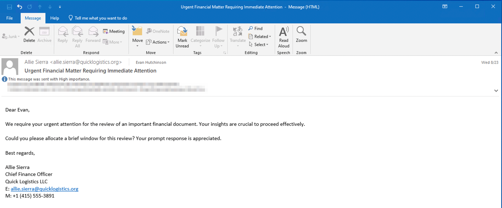

## Investigation Findings

Task 1 – What is the PID of the process that executed the initial stage 1 payload?
 - Method: Searched logs for `ProjectFinancialSumary_Q3.pdf` using Lucene syntax in Kibana.
 - Finding: File executed by process PID 6392.
 - Answer: `6392`

  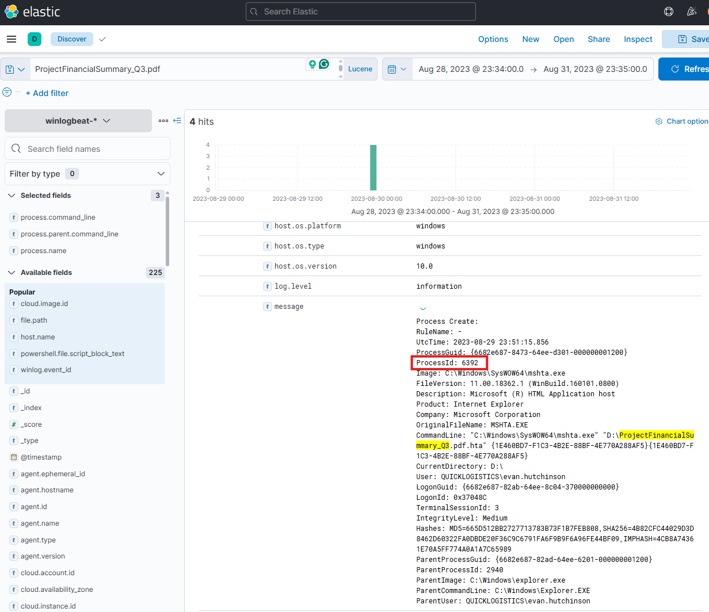
 

---
Task 2: The stage 1 payload attempted to implant a file to another location. What is the full command-line value of this execution?

 - Finding: Used `xcopy.exe` to implant `review.dat` to Temp folder.

 - Answer:
``` "C:\Windows\System32\xcopy.exe" /s /i /e /h D:\review.dat C:\Users\EVAN~1.HUT\AppData\Local\Temp\review.dat```

  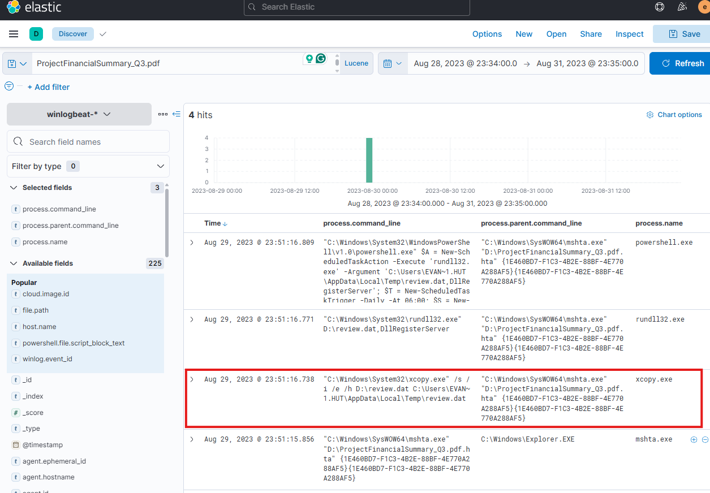


 ---
Task 3: The implanted file was eventually used and executed by the stage 1 payload. What is the full command-line value of this execution?

 - Finding: review.dat executed via rundll32.exe.
 - Answer:
``` "C:\Windows\System32\rundll32.exe" D:\review.dat,DllRegisterServer ```

  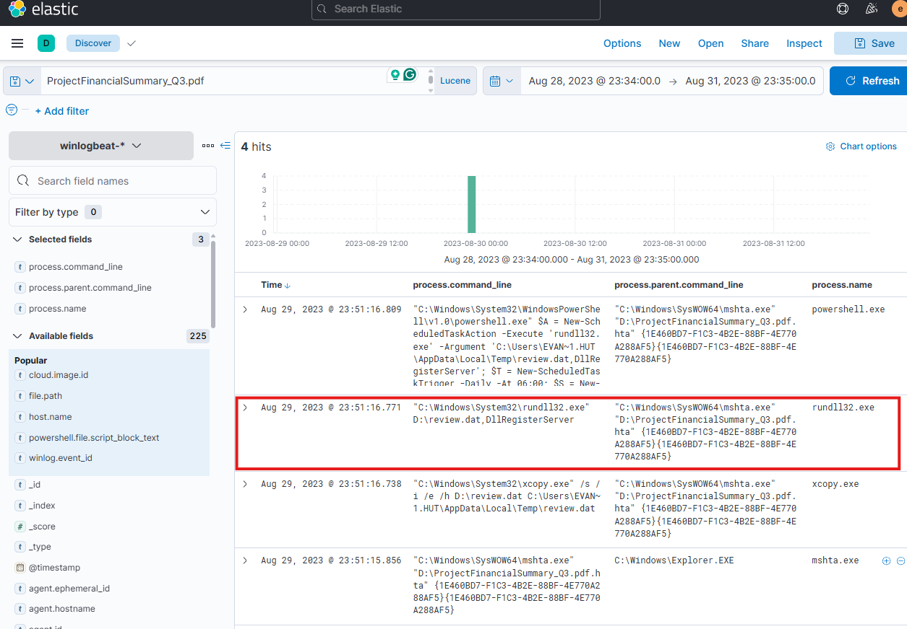
 

---
Task 4: The stage 1 payload established a persistence mechanism. What is the name of the scheduled task created by the malicious script?

 - Finding: Created scheduled task named `Review` to execute DLL daily at 06:00.

 - Answer: `Review`

  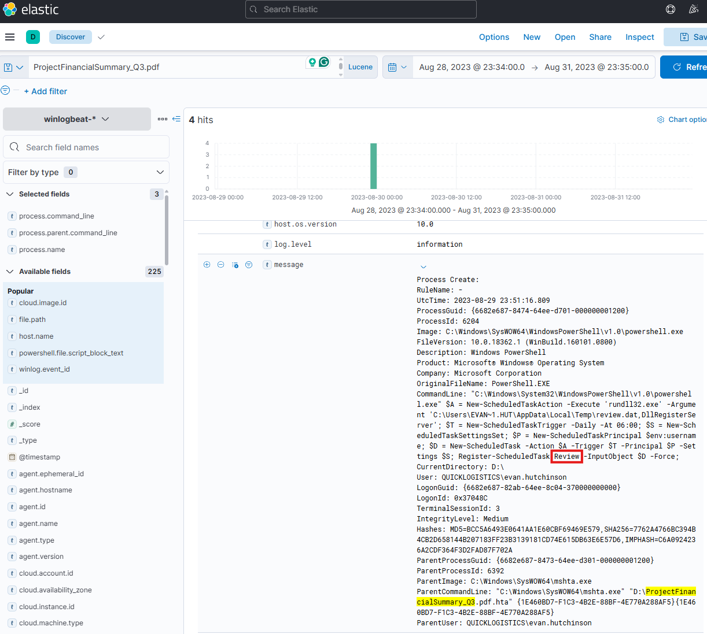


---
Task 5: The execution of the implanted file inside the machine has initiated a potential C2 connection. What is the IP and port used by this connection? (format: IP:port)

 - Finding: Outbound connection from `rundll32.exe` to 165.232.170.151:80.
 - Answer: `165.232.170.151:80`

  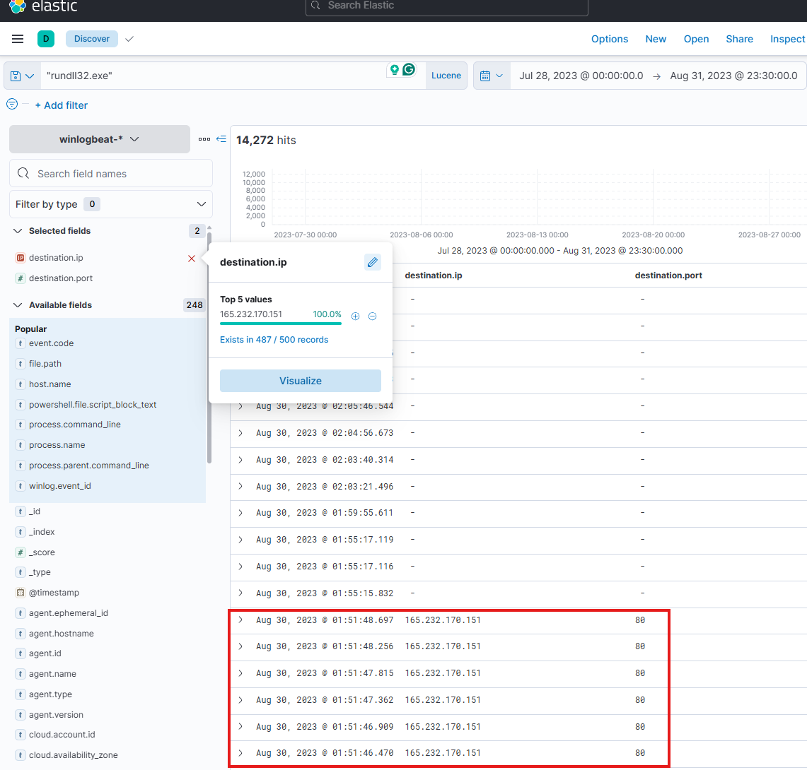


---
Task 6: The attacker has discovered that the current access is a local administrator. What is the name of the process used by the attacker to execute a UAC bypass?

 - Finding: Used auto-elevated binary `fodhelper.exe` before executing malicious DLL.

 - Answer: `fodhelper.exe`

  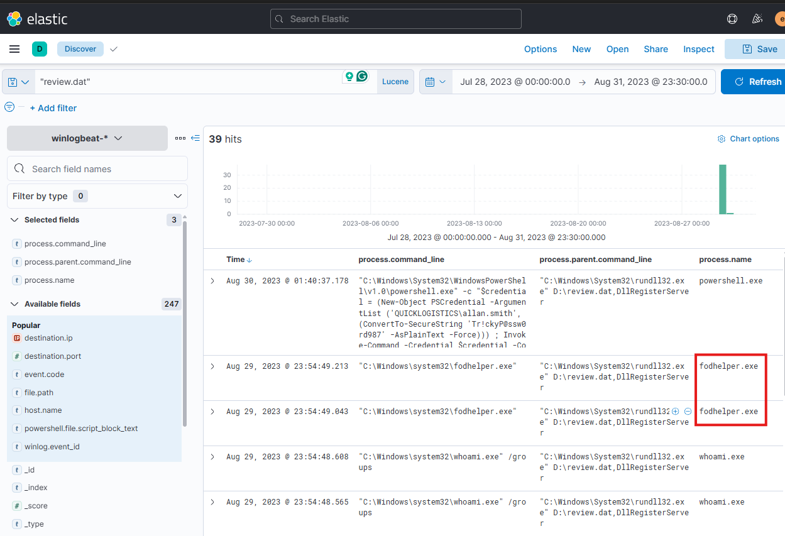


---
Task 7: Having a high privilege machine access, the attacker attempted to dump the credentials inside the machine. What is the GitHub link used by the attacker to download a tool for credential dumping?

 - Finding: Used PowerShell `iwr` to download Mimikatz from GitHub.

 - Answer: `https://github.com/gentilkiwi/mimikatz/releases/download/2.2.0-20220919/mimikatz_trunk.zip`

  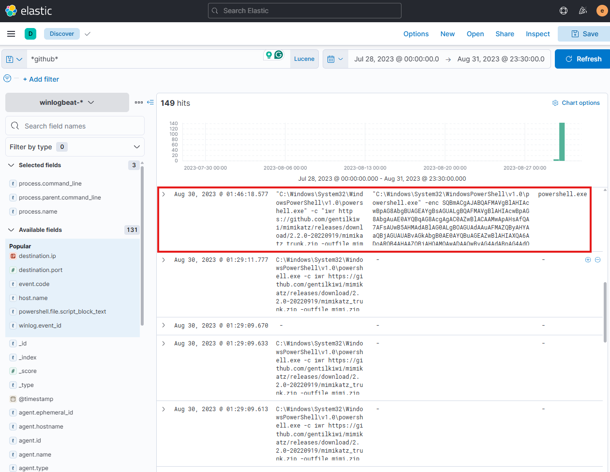
 

---
Task 8: After successfully dumping the credentials inside the machine, the attacker used the credentials to gain access to another machine. What is the username and hash of the new credential pair? (format: username:hash)

 - Finding: Used Mimikatz `sekurlsa::pth` to spawn session as `itadmin`.

 - Answer: `itadmin:F84769D250EB95EB2D7D8B4A1C5613F2`

  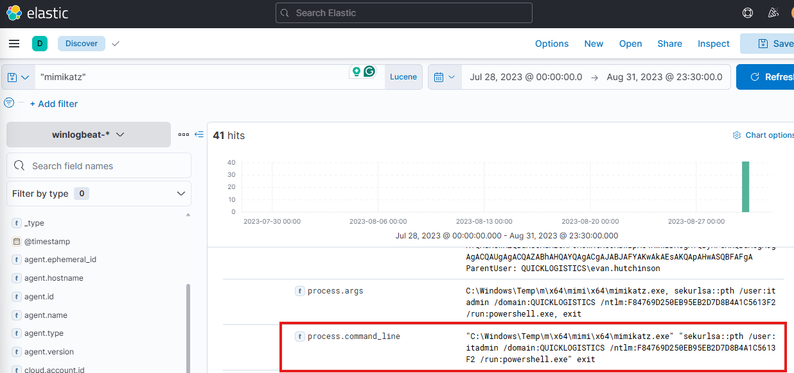


---  
Task 9: Using the new credentials, the attacker attempted to enumerate accessible file shares. What is the name of the file accessed by the attacker from a remote share?

 - Finding: Read script `IT_Automation.ps1` from `\\WKSTN-1327\ITFiles`.

 - Answer: `IT_Automation.ps1`

  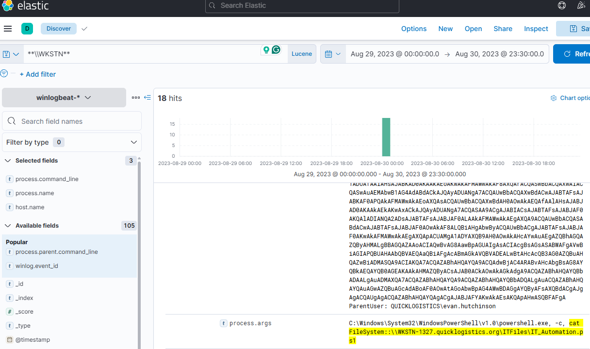

  
---
Task 10: After getting the contents of the remote file, the attacker used the new credentials to move laterally. What is the new set of credentials discovered by the attacker? (format: username:password)

 - Finding: Used `allan.smith` credentials for remote PowerShell execution.

 - Answer: `QUICKLOGISTICS\allan.smith:Tr!ckyP@ssw0rd987`
 
  


---
Task 11: What is the hostname of the attacker's target machine for its lateral movement attempt?

 - Answer: `WKSTN-1327`


---
Task 12: Using the malicious command executed by the attacker from the first machine to move laterally, what is the parent process name of the malicious command executed on the second compromised machine?

 - Answer: `wsmprovhost.exe`

  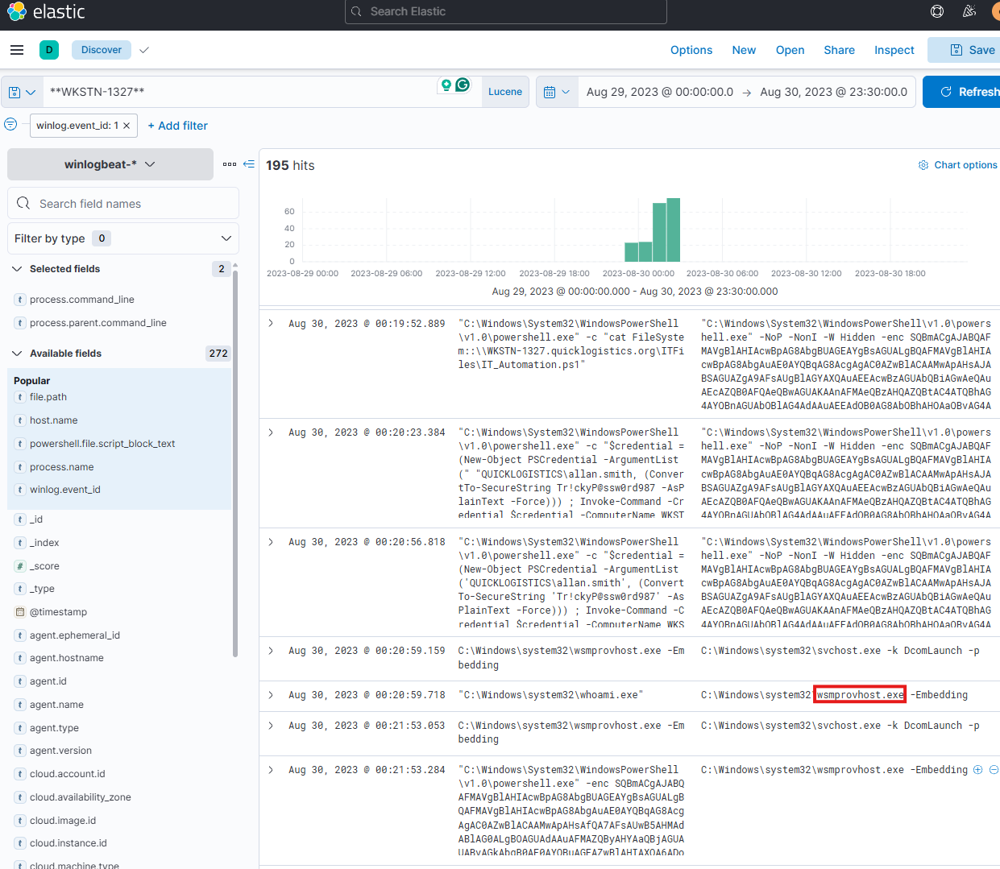


---
Task 13: The attacker then dumped the hashes in this second machine. What is the username and hash of the newly dumped credentials? (format: username:hash)

 - Answer: `administrator:00f80f2538dcb54e7adc715c0e7091ec`

  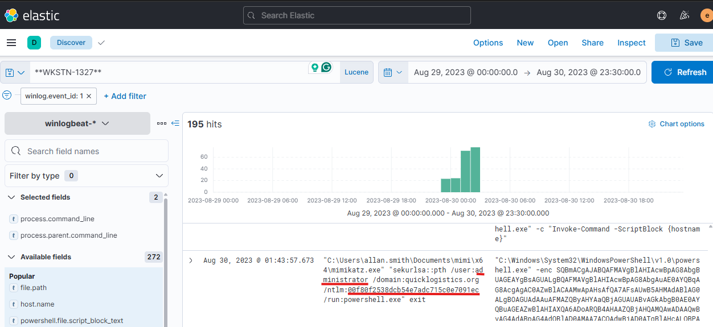


---
Task 14: After gaining access to the domain controller, the attacker attempted to dump the hashes via a DCSync attack. Aside from the administrator account, what account did the attacker dump?

 - Answer: `backupda`

  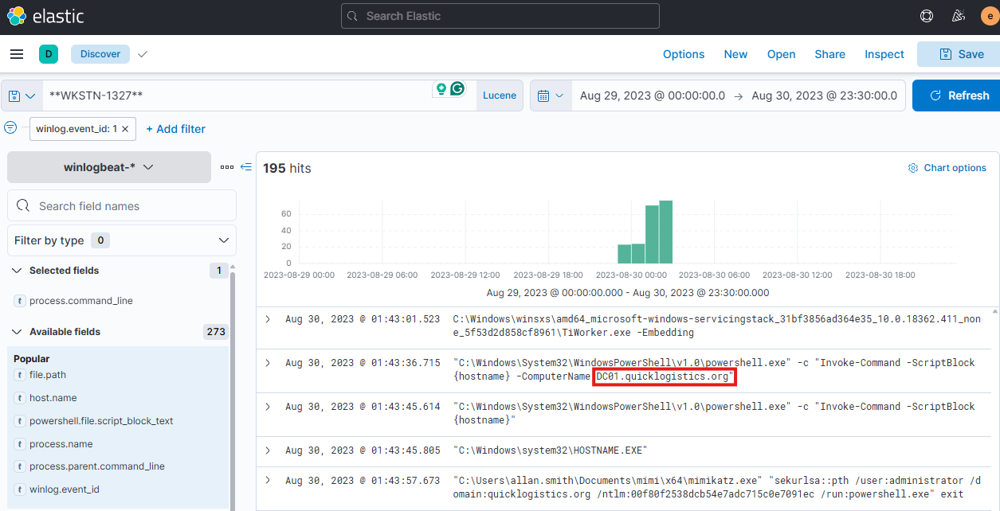

  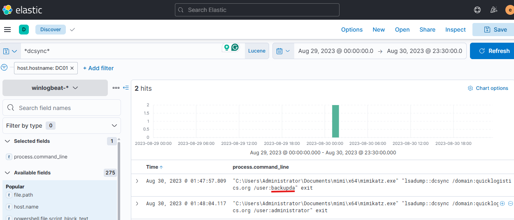


---
Task 15: After dumping the hashes, the attacker attempted to download another remote file to execute ransomware. What is the link used by the attacker to download the ransomware binary?

 - Answer: `http://ff.sillytechninja.io/ransomboogey.exe`

 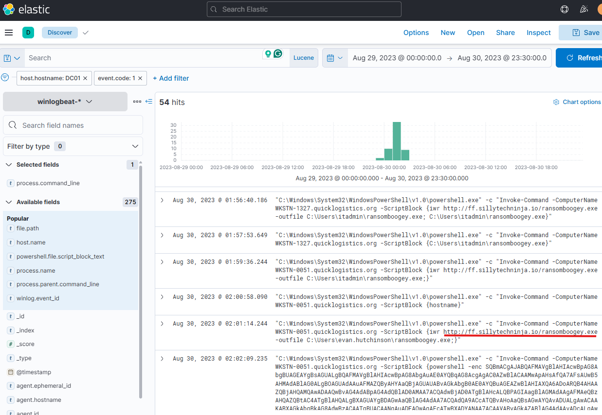


---
## Key Tactics Observed
 - Initial Access: Phishing email with disguised .hta payload.
 - Execution: mshta.exe, rundll32.exe loading malicious DLL.
 - Persistence: Scheduled task via PowerShell.
 - Privilege Escalation: UAC bypass with fodhelper.exe.
 - Credential Access: Mimikatz for NTLM hash extraction.
 - Lateral Movement: Pass-the-Hash, PowerShell Remoting.
 - Command & Control: HTTP over port 80.
 - Impact Attempt: Ransomware download.
