Lurking in the Dark
Without tripping any security defences of Quick Logistics LLC, the Boogeyman was able to compromise one of the employees and stayed in the dark, waiting for the right moment to continue the attack. Using this initial email access, the threat actors attempted to expand the impact by targeting the CEO, Evan Hutchinson. 

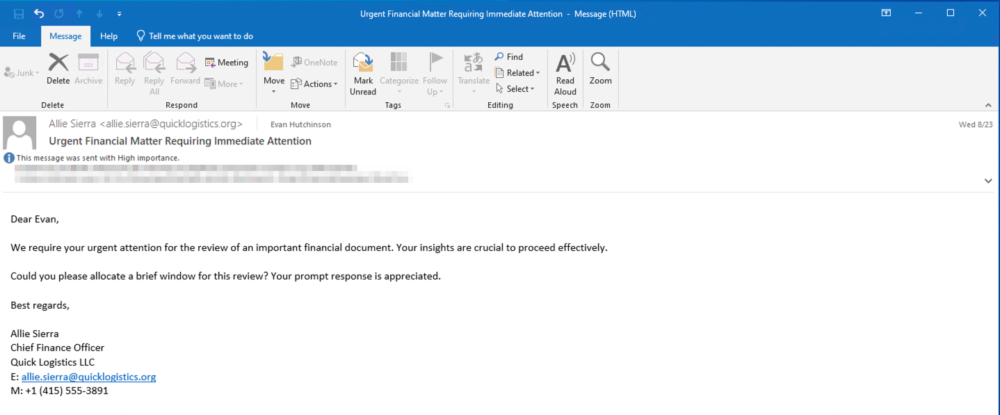

The email appeared questionable, but Evan still opened the attachment despite the scepticism. After opening the attached document and seeing that nothing happened, Evan reported the phishing email to the security team.
Initial Investigation
Upon receiving the phishing email report, the security team investigated the workstation of the CEO. During this activity, the team discovered the email attachment in the downloads folder of the victim.

 
In addition, the security team also observed a file inside the ISO payload, as shown in the image below.

Lastly, it was presumed by the security team that the incident occurred between August 29 and August 30, 2023.
Given the initial findings, you are tasked to analyse and assess the impact of the compromise.

Task 1: What is the PID of the process that executed the initial stage 1 payload?

To identify the process responsible for executing the initial payload, I began by searching for logs referencing the malicious attachment ProjectFinancialSumary_Q3.pdf using Kibana’s default KQL (Kibana Query Language). However, this approach returned no results—likely due to limitations in how KQL parses data or how the fields were indexed.
I then switched to Lucene syntax, which uses a different query engine. Searching with the same keyword (ProjectFinancialSumary_Q3.pdf) in Lucene returned four hits, confirming that the filename did exist within the indexed logs but was not being matched properly by KQL.
From the Lucene results, I identified log entries referencing the PDF and extracted the associated Process ID (PID): 6392. I then performed a child process analysis, which revealed that this parent process led to the execution of the initial payload—typically involving powershell.exe or another living-off-the-land binary shortly after the file interaction.

Answer : PID 6392

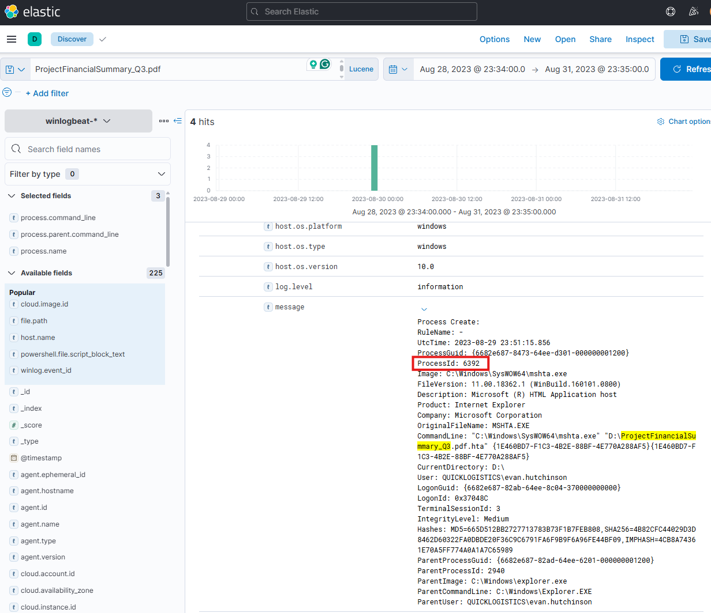
 

Task 2: The stage 1 payload attempted to implant a file to another location. What is the full command-line value of this execution?

I found that the attacker used xcopy.exe to implant a file named review.dat into the victim’s temp folder. The full command was:

Answer : "C:\Windows\System32\xcopy.exe" /s /i /e /h D:\review.dat C:\Users\EVAN~1.HUT\AppData\Local\Temp\review.dat

This shows the stage 1 payload tried to move a file from D:\ to the user’s temp folder. The parent process was mshta.exe, which launched a fake PDF file (ProjectFinancialSummary_Q3.pdf.hta). This confirms the attacker used a disguised file to start the infection and implant the next stage.

 
Task 3: The implanted file was eventually used and executed by the stage 1 payload. What is the full command-line value of this execution?

To determine whether the implanted file (review.dat) was eventually used, I examined the process creation logs for suspicious executions involving that filename. I found a key log entry showing that the attacker executed the file using the Windows rundll32.exe utility—a common living-off-the-land binary (LOLBIN) often abused to run malicious DLL code.
The full command-line used was:
Answer: "C:\Windows\System32\rundll32.exe" D:\review.dat,DllRegisterServer

This confirms that the attacker loaded the review.dat file as a DLL and invoked its DllRegisterServer function to execute its payload. The process ran under the context of the user evan.hutchinson and was a child of mshta.exe, which originally launched the fake PDF file (ProjectFinancialSummary_Q3.pdf.hta).
This activity demonstrates a common malware technique where the attacker:
1.	Delivers a disguised .hta file
2.	Uses xcopy.exe to implant a second-stage payload (review.dat)
3.	Executes the payload using rundll32.exe
This staged execution chain helped evade detection by using only trusted system processes.

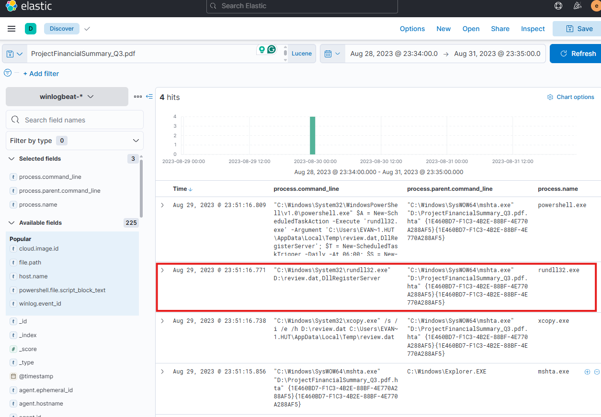
 
Task 4: The stage 1 payload established a persistence mechanism. What is the name of the scheduled task created by the malicious script?

Upon further analysis of the process logs, I identified a PowerShell command executed shortly after the initial payload, which was responsible for creating a scheduled task. This persistence mechanism ensures that the implanted DLL (review.dat) will be executed regularly without requiring further user interaction.
The PowerShell command executed was:
powershell.exe $A = New-ScheduledTaskAction -Execute 'rundll32.exe' -Argument 'C:\Users\EVAN~1.HUT\AppData\Local\Temp\review.dat,DllRegisterServer'; 
$T = New-ScheduledTaskTrigger -Daily -At 06:00; 
$S = New-ScheduledTaskSettingsSet; 
$P = New-ScheduledTaskPrincipal $env:username; 
$D = New-ScheduledTask -Action $A -Trigger $T -Principal $P -Settings $S; 
Register-ScheduledTask Review -InputObject $D -Force;

From this, I confirmed the attacker created a scheduled task named Review, configured to run daily at 6:00 AM using rundll32.exe to execute the malicious DLL.
This technique is a well-known method of maintaining persistence using native Windows tools (schtasks or PowerShell task cmdlets), which helps attackers evade detection.
Answer : Review

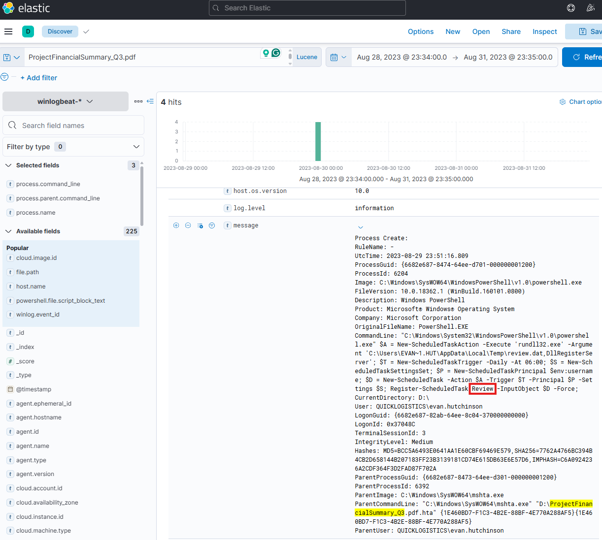

Task 5: The execution of the implanted file inside the machine has initiated a potential C2 connection. What is the IP and port used by this connection? (format: IP:port)

To identify the IP address and port used for the potential C2 connection, I searched the logs in Kibana for any network activity associated with the process rundll32.exe, which I had previously confirmed executed the malicious file review.dat.
Using the keyword:
"rundll32.exe"
I filtered for logs containing destination IP and port fields. Only one unique outbound network connection was found associated with this process, which included:

Answer:
•	Destination IP: 165.232.170.151
•	Destination Port: 80
This strongly suggests that this connection was used as the C2 channel, initiated immediately after the malicious DLL was executed.

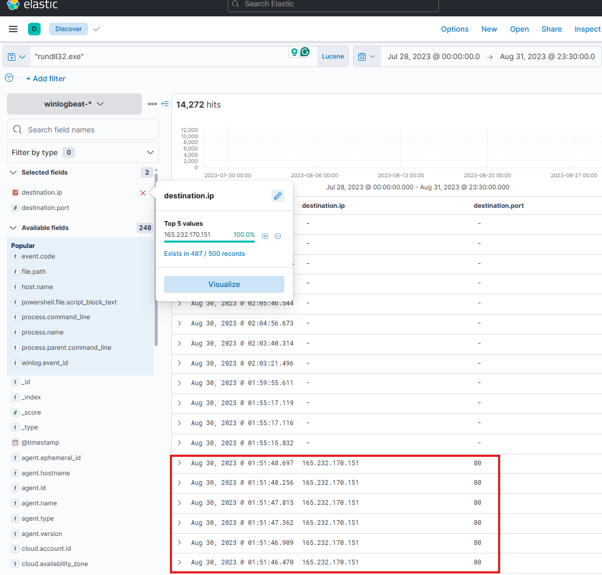

 

Task 6: The attacker has discovered that the current access is a local administrator. What is the name of the process used by the attacker to execute a UAC bypass?

To determine which process was used by the attacker to execute a UAC bypass, I searched for the implanted file review.dat, which was previously executed via rundll32.exe. Upon reviewing the timeline, I observed a notable event where fodhelper.exe was launched and immediately followed by a call to rundll32.exe with D:\review.dat,DllRegisterServer as the argument.
fodhelper.exe is a known auto-elevated binary (LOLBIN) that, when abused correctly, allows attackers to execute payloads with elevated privileges without triggering a UAC prompt. Its presence directly before the execution of review.dat suggests the attacker used it as part of a UAC bypass technique.
Additionally, surrounding activity such as the use of whoami.exe /groups indicates that the attacker was checking for elevated privileges, reinforcing that this stage was part of privilege escalation or validation.

Answer : fodhelper.exe

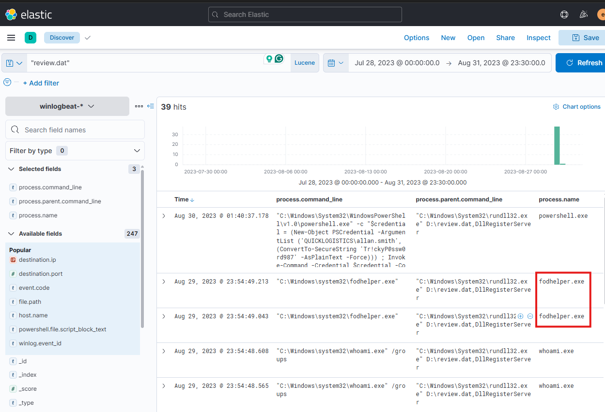

Task 7: Having a high privilege machine access, the attacker attempted to dump the credentials inside the machine. What is the GitHub link used by the attacker to download a tool for credential dumping?

I searched process creation events involving powershell.exe and filtered for keyword patterns such as *github*, *iwr*, and *download*.
I identified a command using Invoke-WebRequest (iwr) to retrieve a ZIP file from the following GitHub URL:
Answer : https://github.com/gentilkiwi/mimikatz/releases/download/2.2.0-20220919/mimikatz_trunk.zip
This is a known repository for Mimikatz, a widely used post-exploitation tool for credential dumping. This confirms the attacker's intent to extract credentials using this tool after escalating privileges.

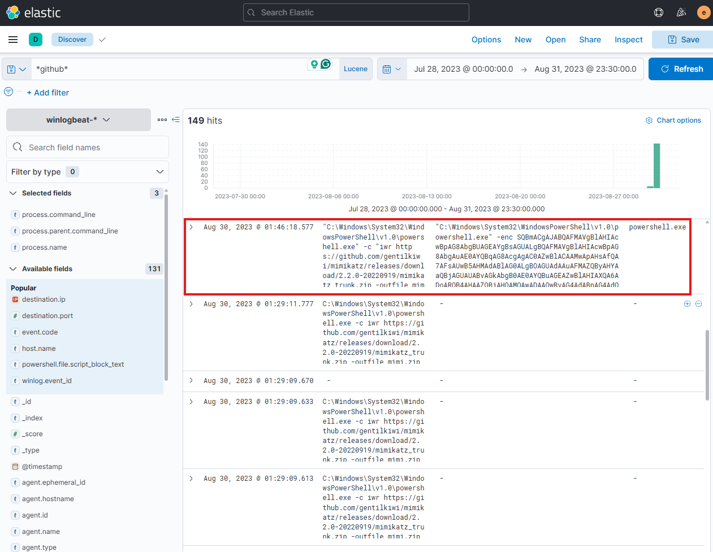
 

Task 8: After successfully dumping the credentials inside the machine, the attacker used the credentials to gain access to another machine. What is the username and hash of the new credential pair? (format: username:hash)

I searched for the keyword "mimikatz" and discovered that the attacker executed mimikatz.exe from C:\Windows\Temp\m\x64\mimi\x64\ using the command sekurlsa::pth to perform a Pass-the-Hash (PtH) attack. This command used the credentials of the user itadmin and an NTLM hash to spawn a new process (powershell.exe) under that user context. This indicates that the attacker used stolen credentials to move laterally or escalate privileges within the environment. The action was executed by the user evan.hutchinson, showing the attack leveraged their session.

Answer: itadmin:F84769D250EB95EB2D7D8B4A1C5613F2

  
Task 9: Using the new credentials, the attacker attempted to enumerate accessible file shares. What is the name of the file accessed by the attacker from a remote share?

After gaining access with the new credentials (itadmin), the attacker used PowerShell to access a file from a remote SMB share. The command cat FileSystem::\\WKSTN-1327.quicklogistics.org\ITFiles\IT_Automation.ps1 indicates the attacker viewed the contents of the script file located on the machine WKSTN-1327 under the shared folder ITFiles.

Answer : IT_Automation.ps1

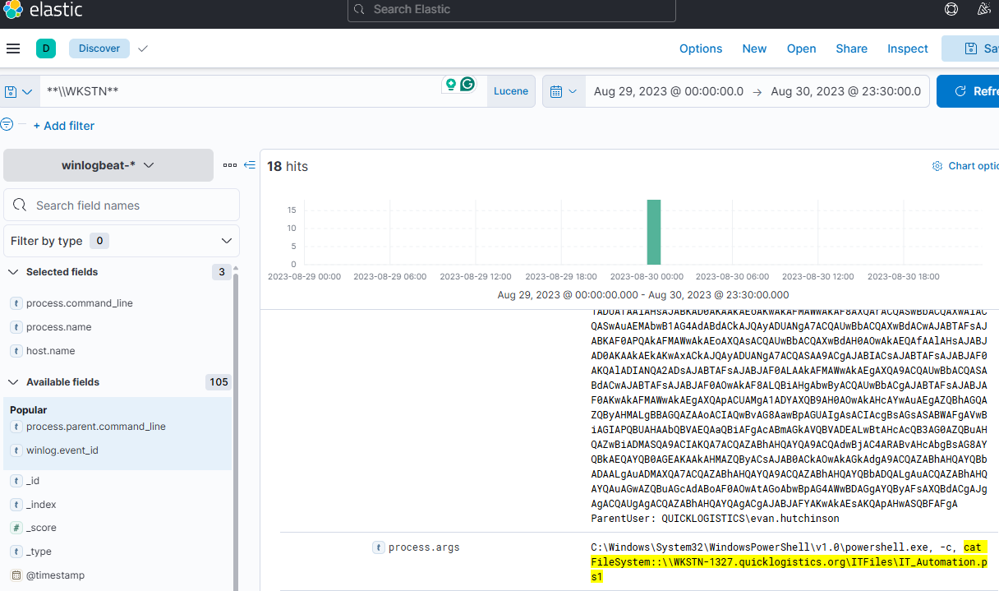

Task 10: After getting the contents of the remote file, the attacker used the new credentials to move laterally. What is the new set of credentials discovered by the attacker? (format: username:password)

While investigating activity on the host WKSTN-0051.quicklogistics.org, I filtered for the powershell.exe process and found a suspicious remote command execution. The attacker used PowerShell to pass the credentials of QUICKLOGISTICS\allan.smith with the password Tr!ckyP@ssw0rd987, then ran Invoke-Command to remotely access WKSTN-1327 and execute the command whoami. This indicates lateral movement using stolen or guessed credentials to test access on another machine.
Answer: QUICKLOGISTICS\allan.smith:Tr!ckyP@ssw0rd987
 
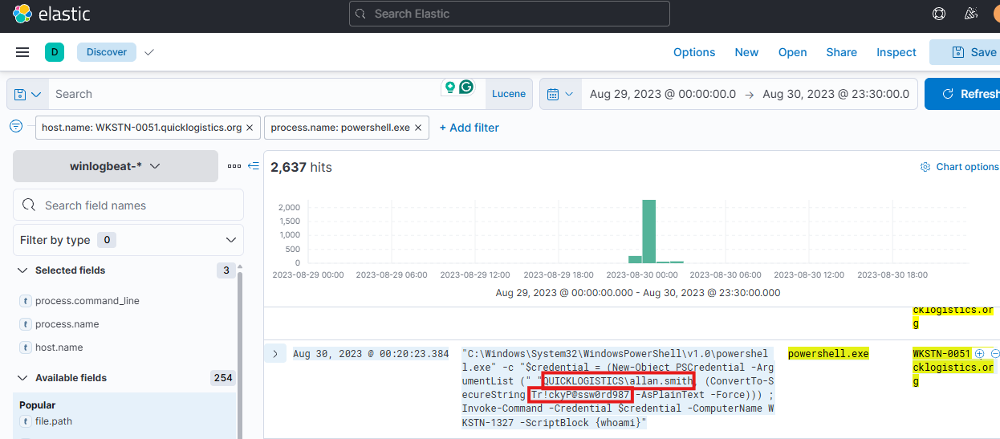

Task 11: What is the hostname of the attacker's target machine for its lateral movement attempt?
To identify the target machine of the attacker’s lateral movement, I analyzed PowerShell activity on WKSTN-0051.quicklogistics.org. The command used Invoke-Command to remotely access another host, specifying WKSTN-1327 as the target. This confirms that the attacker attempted lateral movement to WKSTN-1327.

Answer: WKSTN-1327

Task 12: Using the malicious command executed by the attacker from the first machine to move laterally, what is the parent process name of the malicious command executed on the second compromised machine?

The attacker used PowerShell Remoting (Invoke-Command) from the source machine to run a command on the target machine (WKSTN-1327). On the target, the command was executed through the WinRM service, and the parent process of the malicious PowerShell command was wsmprovhost.exe, which is responsible for handling remote PowerShell sessions.

Answer: wsmprovhost.exe

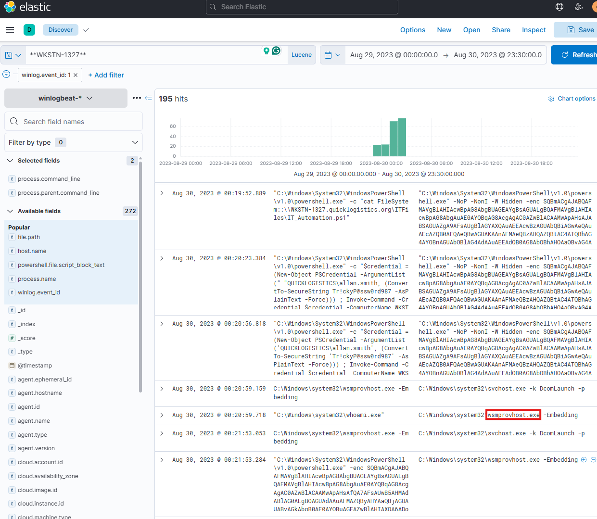

Task 13: The attacker then dumped the hashes in this second machine. What is the username and hash of the newly dumped credentials? (format: username:hash)

I found a mimikatz command executed on the second machine (likely WKSTN-1327) that performs a Pass-the-Hash (PTH) attack using:
•	Username: administrator
•	NTLM hash: 00f80f2538dcb54e7adc715c0e7091ec
Answer: administrator:00f80f2538dcb54e7adc715c0e7091ec

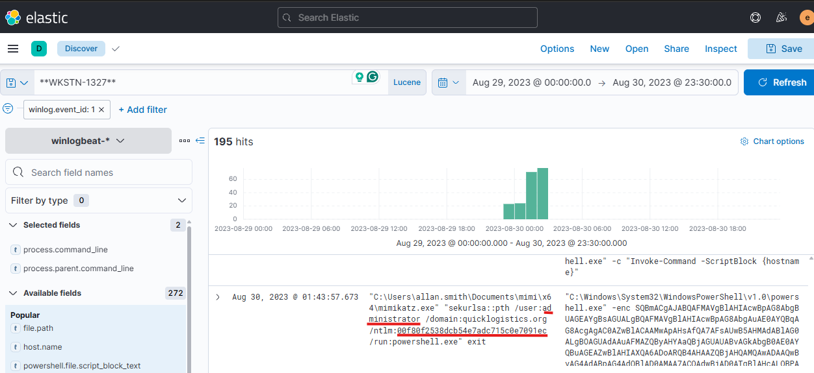

Task 14: After gaining access to the domain controller, the attacker attempted to dump the hashes via a DCSync attack. Aside from the administrator account, what account did the attacker dump?

I searched for host.name = dc01 and filtered logs containing the keyword dcsync. I found that the attacker executed the command lsadump::dcsync /domain:quicklogistics.org /user:backupda using Mimikatz. This command is used to simulate a domain controller and request account credentials. From this, I identified that the attacker targeted the user backupda, meaning this is the newly dumped credential.

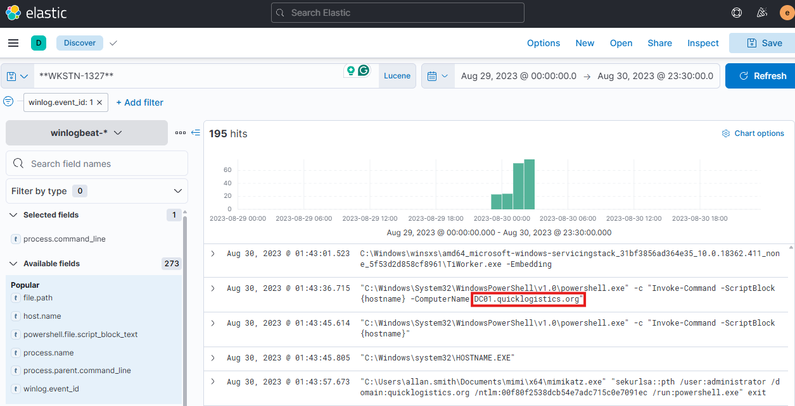

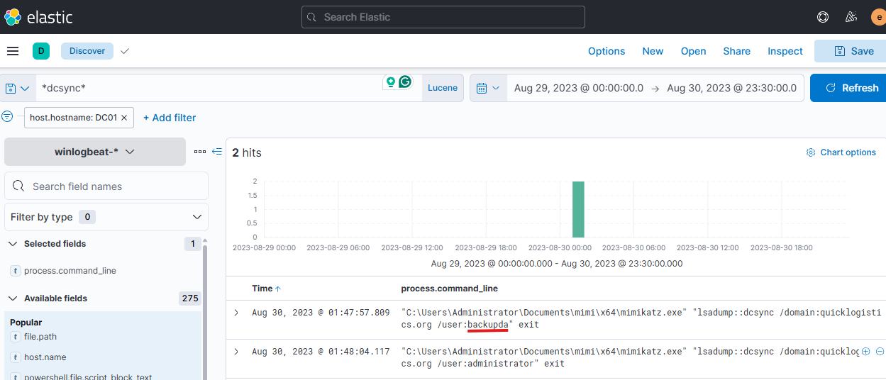

 

Task 15: After dumping the hashes, the attacker attempted to download another remote file to execute ransomware. What is the link used by the attacker to download the ransomware binary?
I applied the filter host.hostname = dc01 and looked for event.code: 1, which logs process creation events. I found a PowerShell command executed on the domain controller that used Invoke-Command to remotely run a script on the workstation WKSTN-0051. The script contained an iwr (Invoke-WebRequest) command to download a suspicious file named ransomboogey.exe from the URL http://ff.sillytechninja.io/ransomboogey.exe. This indicates the attacker attempted to download and execute a ransomware binary on the remote machine.

 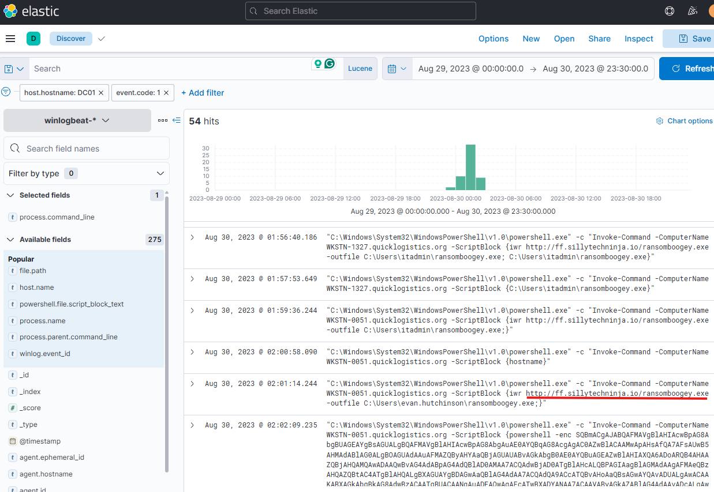
