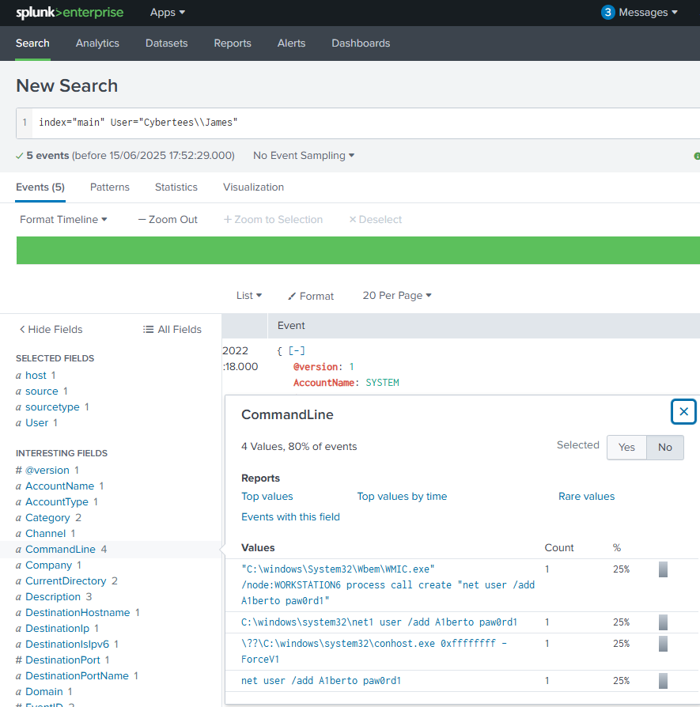
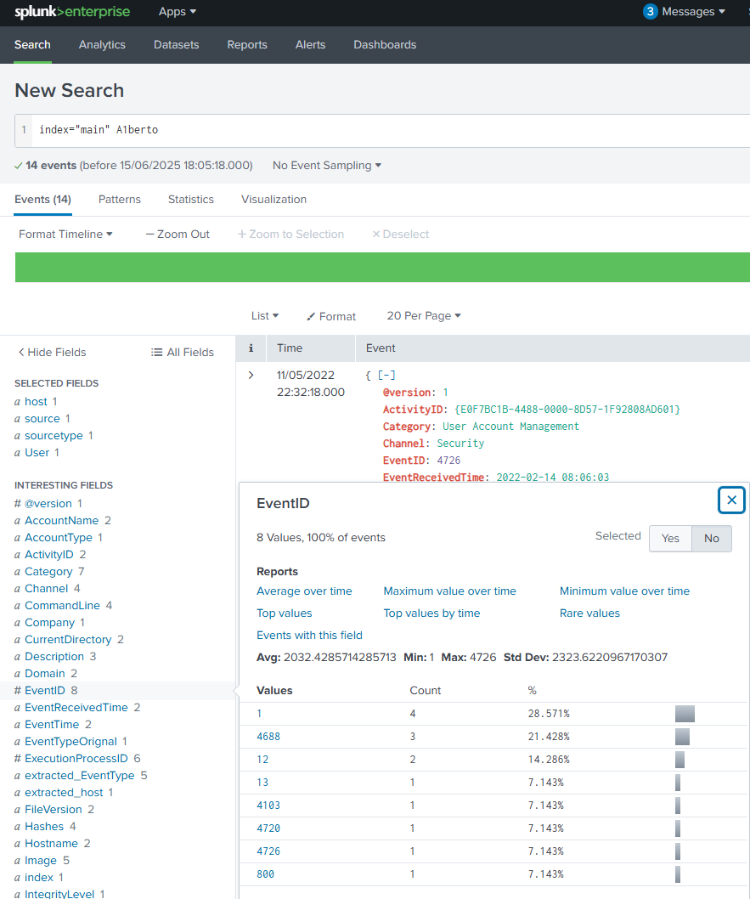
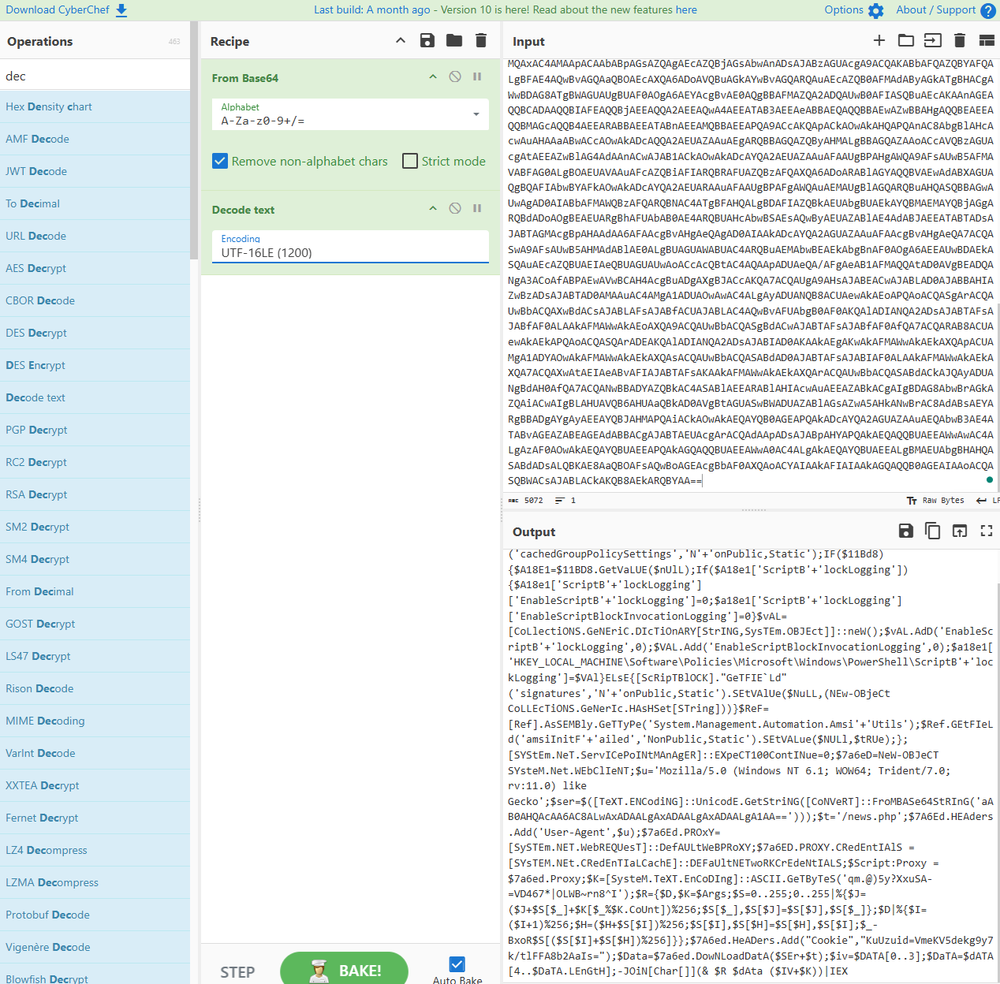
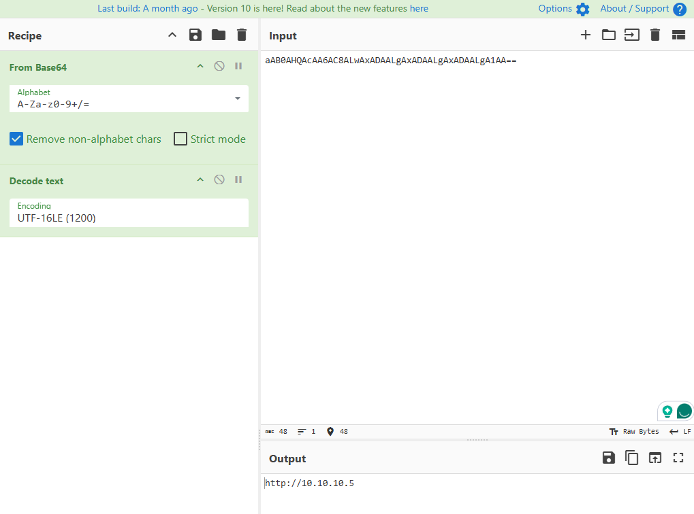

## TryHackMe – Investigating with Splunk

**Scenario:**
SOC Analyst Johny observed suspicious activity in logs from multiple Windows machines. Evidence suggests the adversary gained access and created a backdoor account. Our task was to ingest the logs into Splunk and identify anomalies.

---

**Task 1:** How many events were collected and Ingested in the index main?

**Finding:** 12,256 events ingested into main.

**Answer:** `12256 events.`

   

---
**Task 2:** On one of the infected hosts, the adversary was successful in creating a backdoor user. What is the new username?

**Finding:** One account creation event found. 

**Answer:** `A1berto`

   

----
**Task 3:** On the same host, a registry key was also updated regarding the new backdoor user. What is the full path of that registry key?

Go to back to: index="main" – > select: Category="Registry object added or deleted (rule: RegistryEvent)"

   

**Finding:** Registry key created for backdoor user.

**Answer:** `HKLM\SAM\SAM\Domains\Account\Users\Names\A1berto`
 

   

---
**Task 4:** Examine the logs and identify the user that the adversary was trying to impersonate.

**Finding:** The attacker created `A1berto` to impersonate legitimate user `Alberto`.

**Answer:** `Alberto`

   

----
**Task 5:** What is the command used to add a backdoor user from a remote computer?

**Finding:** Used WMIC to create a new account remotely on `WORKSTATION6`.

**Answer:** `C:\windows\System32\Wbem\WMIC.exe" /node:WORKSTATION6 process call create "net user /add A1berto paw0rd1`

   

---
**Task 6:** How many times was the login attempt from the backdoor user observed during the investigation?

**Finding:** No logon attempt events (`4624` or `4625`) for `A1berto`.

**Answer:** `0`

   

   

---
Task 7: What is the name of the infected host on which suspicious Powershell commands were executed?

Finding: Host executing suspicious PowerShell commands.

Answer: `James.browne`

   

----
**Task 8:** PowerShell logging is enabled on this device. How many events were logged for the malicious PowerShell execution?

**Finding:** EventCode `4103` recorded 79 events.

**Answer:**`79`

   

---
**Task 9:** An encoded PowerShell script from the infected host initiated a web request. What is the full URL?
Go to search bar: index="main" powershell

I saw an encoded PowerShell script 

   

Copy the script to CyberChef. Recipe From Base64 and Decode text (UTF-16LE (1200))
The output there you will see :` FroMBASe64StRInG('aAB0AHQAcAA6AC8ALwAxADAALgAxADAALgAxADAALgA1AA==')));$t='/news.php'`

   

Copy the text: `'aAB0AHQAcAA6AC8ALwAxADAALgAxADAALgAxADAALgA1AA== `  to CyberChef with same recipe. You will see the `http://10.10.10.5.` Then put the `/news.php together http://10.10.10.5/news.php.`

Then go to CyberChef using defang URL.
**Answer:** `hxxp[://]10[.]10[.]10[.]5/news[.]php`

   

  

----
## Key Techniques Observed
- Initial Access: Remote account creation via WMIC.
- Persistence: Registry modification for new user.
- Execution: Malicious PowerShell commands.
- Defense Evasion: Encoded PowerShell scripts.
- C2 Communication: HTTP POST to internal IP.
